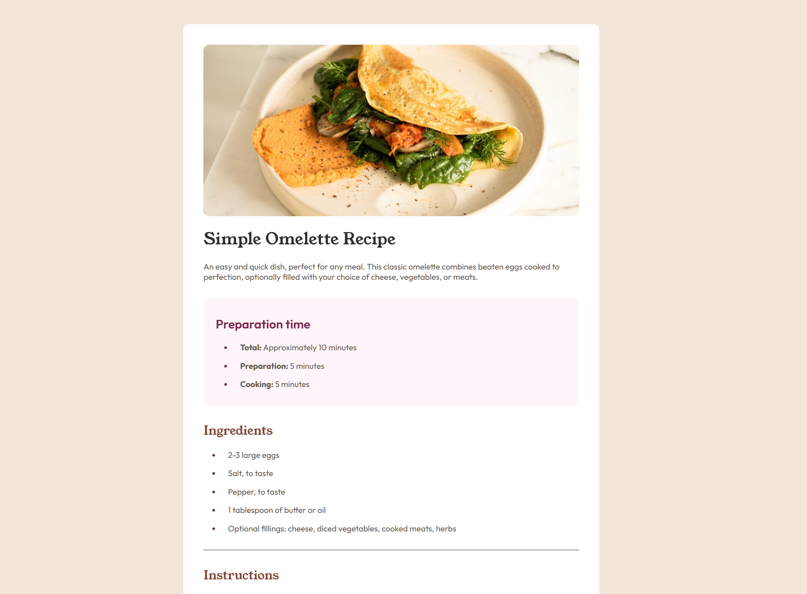

# Frontend Mentor - Recipe page solution

This is a solution to the [Recipe page challenge on Frontend Mentor](https://www.frontendmentor.io/challenges/recipe-page-KiTsR8QQKm).  

## Table of contents

- [Overview](#overview)
  - [The challenge](#the-challenge)
  - [Screenshot](#screenshot)
  - [Links](#links)
- [My process](#my-process)
  - [Built with](#built-with)
  - [What I learned](#what-i-learned)
  - [Continued development](#continued-development)
  - [Useful resources](#useful-resources)
  - [AI Collaboration](#ai-collaboration)

## Overview

This challenge involved styling a recipe page to match a given design with a mobile-first approach.

### Screenshot

### Links

- Live Site URL: [Add live site URL here](https://your-live-site-url.com)

## My process

I wanted to approach this page using a mobile-first methodology. This presented interesting challenges, as I was not very familiar with using media queries. I also wanted to focus on using the correct semantic HTML elements to define the page structure. 

### Built with

- Semantic HTML5 markup
- CSS custom properties
- Flexbox
- Mobile-first workflow

### What I learned

This project was a great test of decision making for semantic structuring of a document, as well as mobile-first development. Now that I feel I have a solid handle on flexbox, structuring the page itself was quite easy. 

The major things I learned in this project were implementing media queries, as wel as several CSS pseudoclasses such as `nth-child` for the table. 

### Continued development

I want to continue practicing mobile-first design and really work to make my pages as responsive as possible. I am really happy with the design for this page.

### Useful resources

- [MDN Media Queries](https://developer.mozilla.org/en-US/docs/Web/CSS/Guides/Media_queries/Using) - A great resource for understanding various CSS media queries which were important for my mobile-first approach and adding my desktop styles.

- [MDN Last-child](https://developer.mozilla.org/en-US/docs/Web/CSS/Reference/Selectors/:last-child) - Documentation for the `:last-child` pseduoclass which I had not known about prior to this challenge. 

### AI Collaboration

I used Claude code sparingly throughout development of this page to ask for direction when stuck. An example of this was trying to style the table element to only include a border in the center-rows. It reccommended me the MDN documentation for last-child, which I hadn't been aware of. 

